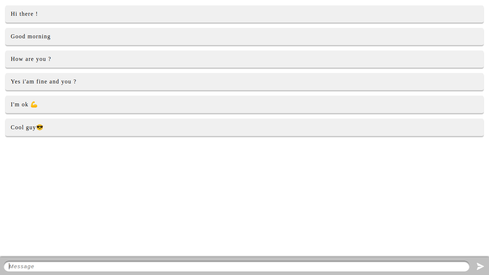

# Nodejs with Socket.io


This small project is made to learn how sockets work and to evaluate this technology on projects making as well as advantages about that.

## Final result
This is the final result of the project:<br/><br/>


## Project installation
### <u>Install curl</u>:
```sh
sudo apt install curl
```

### <u>Install nodejs</u>:
```sh
cd ~;\
curl -sL https://deb.nodesource.com/setup_16.x -o /tmp/nodesource_setup.sh;\
sudo bash /tmp/nodesource_setup.sh;\
sudo apt install nodejs;\
node -v
```

### <u>Project cloning</u>:
```sh
git clone git@github.com:obrymec/Nodejs-Socket.io.git nodejs-with-socket.io/
```

### <u>Install project dependencies</u>:
Go to the root folder of the project and run:
```sh
npm install
npm audit fix
```

### <u>Run project</u>:
Go to the root folder of the project and run:
```sh
npm start
```
Go to your favorite browser and tap on the search bar the following link:
```sh
http://localhost:5000/
```
Enjoy :)
